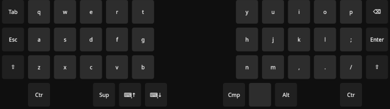
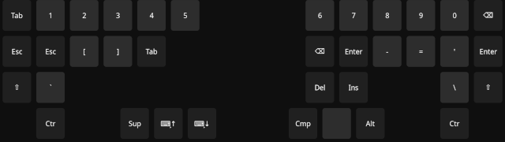

# Split

This layout set was inspired by the [Corne split keyboard](https://github.com/foostan/crkbd) and [QWERTY US-International English](https://en.wikipedia.org/wiki/QWERTY#US-International).

## Screenshtos

The images were updated as of 16th August 2025.

